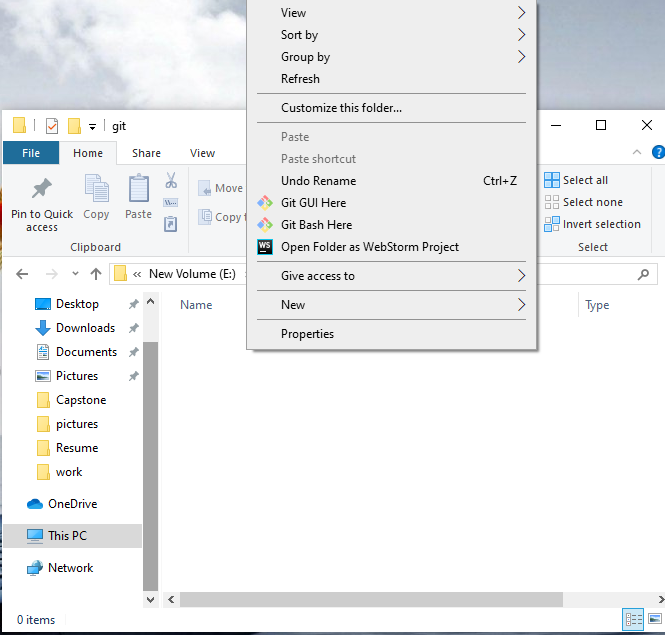
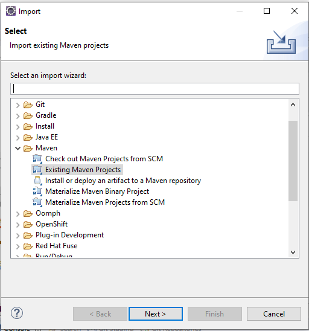
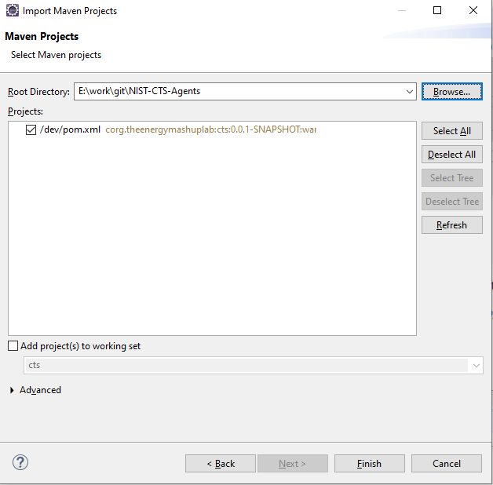
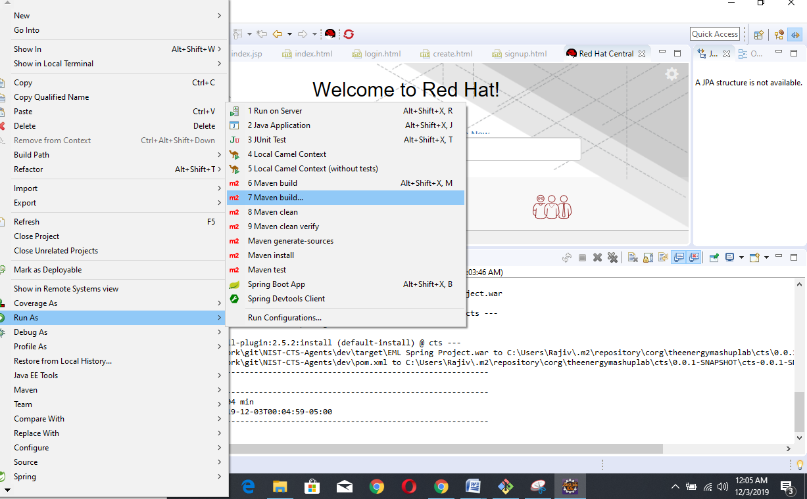
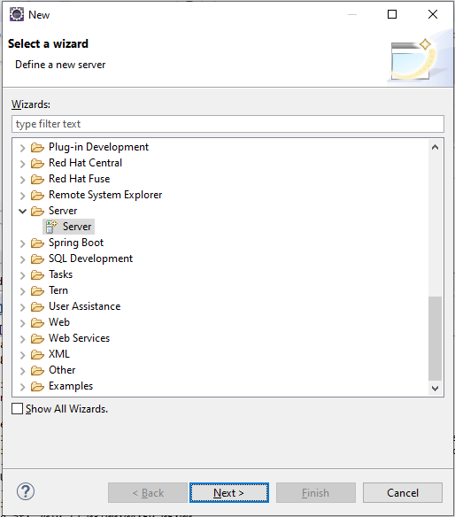
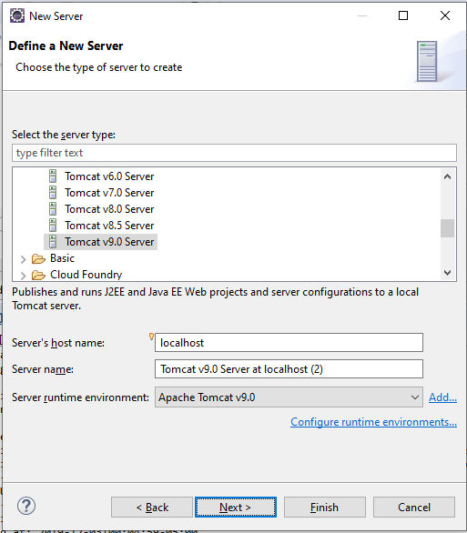
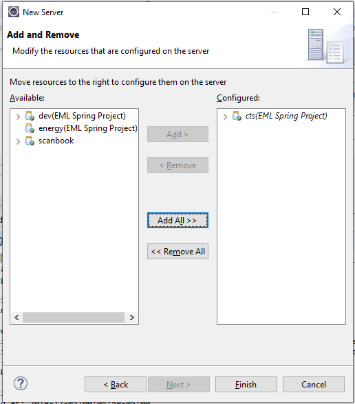
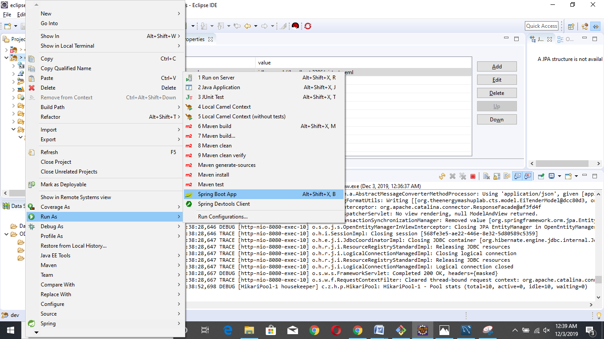

# **Importing Maven Projects from Git into Eclipse**

**Step 1:** Select the folder where you want to create the local storage (on your local machine), right click and select &#39;Git Bash Here&#39;.

**Step 2:** Use the command &#39;git clone&#39; to create a clone of the repository.

Change the directory using &#39;cd&#39; command and go to NIST-CTS-Agents.

**Step 3:** In Eclipse select the File menu and then select Import.

**Step 4:** Select Existing Maven Projects and click on next. (*Note that Eclipse from the Spring Boot download and direct download work the same)*

**Step 5:** Browse to the local NIST-CTS-Agents folder (cloned from Github) and click finish. The project is now imported in Eclipse.

**Step 6:** Right click on project, go to Run As and select Maven Build.

You will get a Build success message in the console. *Note that the Build button will use the most recent detailed build instructions during the current execution of the Eclipse environment*

**Step 7: Configure Tomcat server**
Detailed notes at [this site](https://professionalhacker.in/how-to-install-tomcat-on-mac/)

**Step 8:** Select tomcat server from the list of those installed on your local machine and click next.
Spring Tool Suite 4.5 does not have this wizard selector; instead for Step 8 and Step 9 right click on the project and select a server.

**Step 9:** Move the project to configure it to the server *Picture shows after selecting the project and clicking Add*

Now the server is configured.

**Step 10:** Open MySQL Workbench and create the database &#39;nist\_cts\_eml&#39;. *Note that the MVC models are schemas in a package org.theenergymashuplab.cts.models*
Instructions for the creation using shell commands in the mysql/bin directory are as follows. Remember that semicolon is the terminator for mysql commands, not a separator.
The user name (root@localhost) and password are configured in src/main/resources/application.properties.

* mysql --user=user_name --password db_name
* create database person_example;
* create user 'personuser'@'localhost' identified by 'YOUR_PASSWORD';
* grant all on person_example.* to 'personuser'@'localhost';

**Step 11:** Right click on the project, go to Run As, and click on Spring Boot App.

 

**Step 12:** The project is now running. Open the browser and go to localhost:8080 to view the project.
