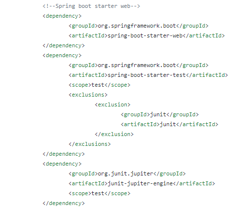
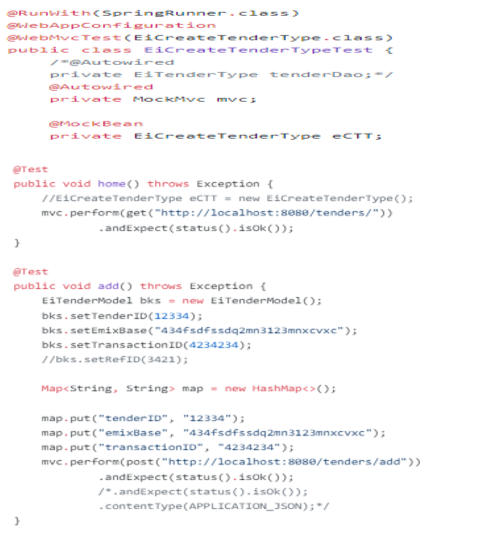
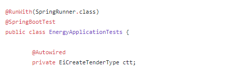

JUnit testing :
JUnit is an open source Unit Testing Framework for JAVA. It is useful for Java Developers to write and run repeatable tests. Erich Gamma and Kent Beck initially develop it. It is an instance of xUnit architecture. As the name implies, it is used for Unit Testing of a small chunk of code.
But, When using JUnit in Spring there are several features added that many developers are not aware of.
First, if you are including the Spring Context in your tests, it becomes an Integration Test, no longer a Unit Test.
To integrate Spring with JUnit, you need spring-test.jar
Specifying dependencies in pom.xml.

Creating a Unit Test Class:
In order for the unit test to run a batch job, the framework must load the job’s ApplicationContext. Two annotations are used to trigger this behavior:
@RunWith(SpringRunner.class): Indicates that the class should use Spring’s JUnit facilities
@ContextConfiguration(…?): In general this indicates which resources to configure the ApplicationContext with. But in this application, we used Autoconfigure with WebMvcTest (import org.springframework.boot.test.autoconfigure.web.servlet.WebMvcTest), which will disable full auto-configuration and instead apply only configuration relevant to MVC tests (i.e. @Controller, @ControllerAdvice, @JsonComponent, Converter/GenericConverter, Filter, WebMvcConfigurer and HandlerMethodArgumentResolver beans but not @Component, @Service or @Repository beans).
By default, tests annotated with @WebMvcTest will also auto-configure Spring Security and MockMvc (include support for HtmlUnit WebClient and Selenium WebDriver). For more fine-grained control of MockMVC the @AutoConfigureMockMvc annotation can be used.
Typically @WebMvcTest is used in combination with @MockBean or @Import to create any collaborators required by your @Controller beans.
For example src/test/java/org/theenergymashuplab/cts/controller/payloads/EiCreateTenderTypeTest.java

	

The above code structure is a Text fixture.
A test fixture is a context where a Test Case runs. Typically, test fixtures include:
* Objects or resources that are available for any test case.
* Activities required that makes these objects/resources available.
* These activities are
1. allocation (setup)
2. de-allocation (teardown).

Now ,If you are looking to load your full application configuration, you should consider @SpringBootTest 
For example in our application : /src/test/java/com/eml/energy/ EnergyApplicationTests.java

