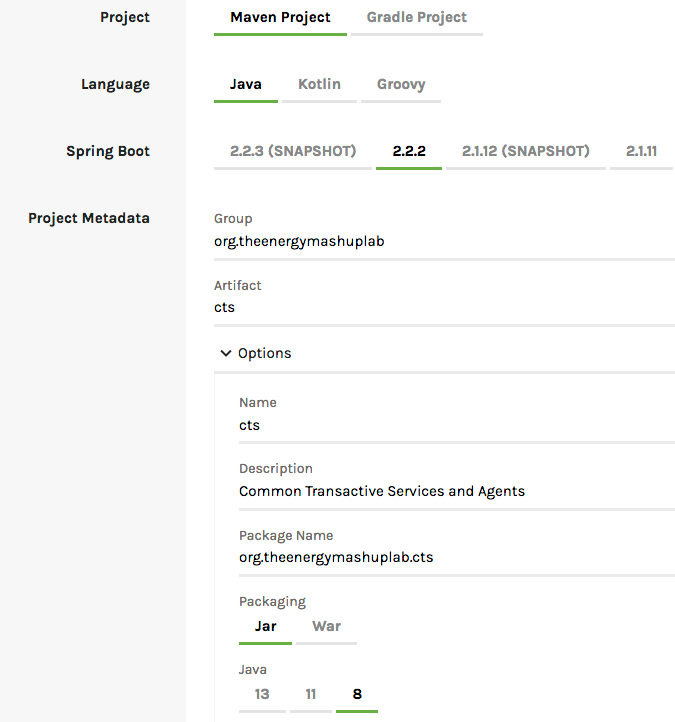
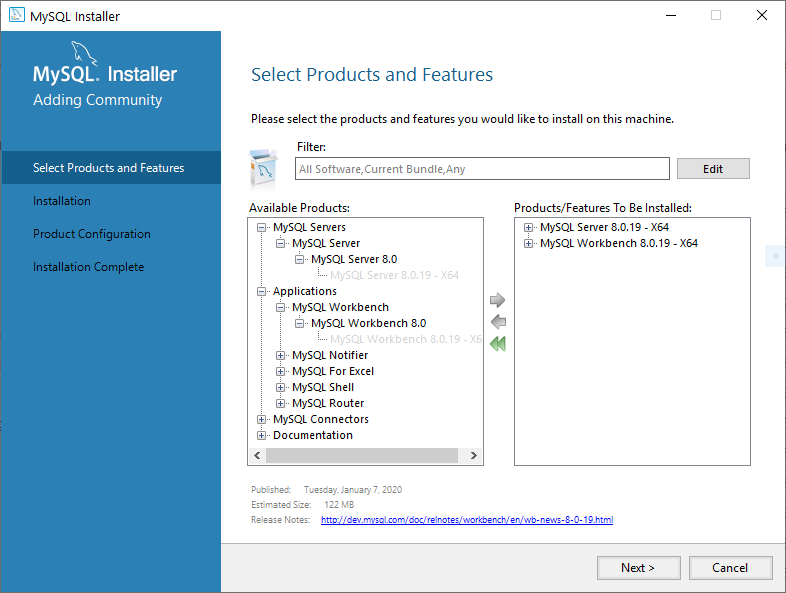

Dependancies and Prerequisites
================================

### Summary of Prerequisites: 
* [Java SE 13 SDK](#java-se)
* [Java EE 8 SDK](#java-ee)
* [Spring Tools 4](#spring-tools-4)
* [Oracle Enterprise Pack for Eclipse](#oracle-enterpise)
* [MySQL Server 5.1 or later](#mysql)
* [MySQL Workbench](#mysql)
* [Apache Tomcat 9](#apache-tomcat)


<a id="java-se"></a>Java SE 13 SDK  
--------------------
Download the appropriate installer for your operating system from the [Java SE 13 download page.](https://www.oracle.com/java/technologies/javase/jdk13-archive-downloads.html#license-lightbox)

### Windows Installation 

The preferred Windows installer is **jdk-13.0.1_windows-x64_bin.exe**.
Run the JDK installer which will create a folder at:
```
    C:\Program Files\Java\jdk-13.0.1
```

#### Creating PATH Enviroment Variable 

1. Go to the **Control Panel** and then **System**.

2. Enter **Advanced** and then **Enviroment Variables**.

3. Add the location of the bin folder to the **PATH** variable in **System Variables**. This location will typically look like this:
```
    C:\Program Files\Java\jdk-13.0.1\bin

```

<a id="java-ee"></a>Java Enterprise Edition 8 SDK
--------------------
You download the universal installer from [Java EE 8 SDK download page](https://www.oracle.com/java/technologies/java-ee-sdk-download.html). You must login to an Oracle account or create a new Oracle account to begin the download.

<a id="spring-tools-4"></a>Spring Tools 4
--------------------
We recommend using the Spring Tools 4 Suite with Eclipse integration.

You can download the appropriate installer for your operating system from [spring.io/tools](https://spring.io/tools).

Once installed, go to [start.spring.io](https://start.spring.io/) and generate a Spring Boot Setup with the following configuration:



Importing the generated folder into Spring Tools 4 will give you the proper configuration for this project.

<a id="oracle-enterpise"></a>Oracle Enterprise Pack for Eclipse (12.2.1.9)
---------------------------------------
Download the appropriate Packaged Distribution for your operating system from [oracle.com/tools/downloads](https://www.oracle.com/tools/downloads/oepe-v12219-downloads.html)

Eclipse must already be installed to install the Oracle Enterprise Pack.


<a id="mysql"></a>MySQL Server and MySQL Workbench
---------------------
This project requires **MySQL 5.1 or later**. 

You can download the appropriate installer for your operating system from [mysql.com/downloads](https://dev.mysql.com/downloads/installer/). There are two installlers on the download page. For this project it is recommended you download **mysql-installer-community-8.0.19.0**.

You will need to login to an Oracle account or create a new Oracle account to begin the download. 

### Windows Installation 
After running the installer you will be prompted to select which MySQL products to install. Select MySQL Server and MySQL Workbench. 



Once MySQL Server and MySQL Workbench have been installed, you will be prompted to configure the products. It is recommended to use the default configuration settings. 

When creating the MySQL database, the user is **root@localhost** and the password can found in **src/main/resources/application.properties**.

### MacOS Installation

MySQL Workbench may require a MacOS system update. 

<a id="apache-tomcat"></a>Apache Tomcat 9
----------------------
You can download Apache Tomcat 9 at [https://tomcat.apache.org/download-90.cgi](https://tomcat.apache.org/download-90.cgi).

It is recommended to download one of the Core packages under the Binary Distributions section. 

### Windows Installation 
Download the **64-bit-Windows.zip** Binary Distribution and extract the contents to your preferred destination. 

See **RUNNING.txt** within the extracted **apache-tomcat-9.0.30** folder for instructions on how to setup Apache Tomcat 9. 