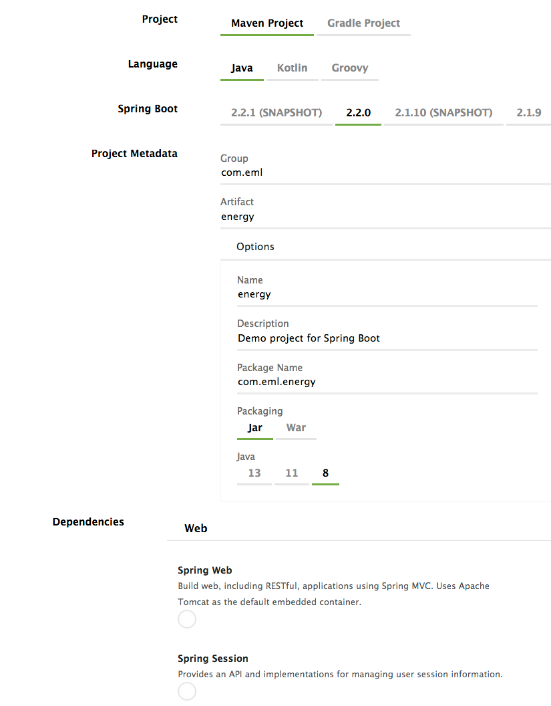

## Download and Set Up Prequisites

Prerequisites for your development environment include JDK for JEE 8, Spring Tool Suite, Eclipse IDE for JEE, MySQL and optionally MySQL Workbench. **NOTE: If you are cloning the code from GitHub, you need only the Java SDKs, Spring Tool IDE, Apache Tomcat Server and MySQL server.**

Package | Mac Download | Windows Download | Notes
------- | ------- | ---------- | --------
Spring Tools 4 | Download from <https://spring.io/tools> | Download from <https://spring.io/tools> | Get the version integrated with Eclipse or follow instructions if you already are using Eclipse
Eclipse 2019-9 | [eclipse-inst-mac64](http://ftp.osuosl.org/pub/eclipse/oomph/epp/2019-09/R/eclipse-inst-mac64.dmg) | | Or other Eclipse Mirror. Download if any only if not using the integrated Spring Tools 4 download
J2EE | [java_ee_sdk-8u1.zip](https://download.oracle.com/otn-pub/java/java_ee_sdk/8/java_ee_sdk-8u1.zip) | | Log in to Oracle site
JDK Java 8 SE | [jdk-13.0.1_osx-x64_bin](https://download.oracle.com/otn-pub/java/jdk/13.0.1+9/cec27d702aa74d5a8630c65ae61e4305/jdk-13.0.1_osx-x64_bin.dmg) | |
Oracle JEE for Eclipse | [oepe-12.2.1.9-photon-distro-macosx-cocoa-x86_64](https://download.oracle.com/otn_software/oepe/12.2.1.9/photon/oepe-12.2.1.9-photon-distro-macosx-cocoa-x86_64.zip) | | Install after Eclipse
Apache Tomcat AS | [https://tomcat.apache.org/download-90.cgi](apache-tomcat-9.0.27.zip) | | May be autoloaded by Spring (*Spring default Server*)
MySQL 5.1 or later  | Download from <https://dev.mysql.com/downloads/installer/> | Download from <https://dev.mysql.com/downloads/installer/> | Workbench may require MacOS System Update; database server more accepting
MySQL Workbench | Download from <https://dev.mysql.com/downloads/workbench/> | Download from <https://dev.mysql.com/downloads/workbench/> |  Workbench must loosely align with database version

## Summary of Setup

Purpose | Framework  | Notes
------- | ------- | ---------- 
Backend Generation | Spring Boot 2.2.0 with Maven | Download from <https://start.spring.io/>. Follow dependencies below.
Front End | React JS | Not yet used - placeholder
IDE | Spring Tool 4 | Download version with Eclipse unless you already use Eclipse
Database | MySQL Version 5.1 or later | See Prerequisites for Workbench and verion information. Download from <https://dev.mysql.com/downloads/installer/> or use online services or any cloud server in which you have MySQL already setup.
Version Management | Github.com | [Project Home Page](https://github.com/EnergyMashupLab/NIST-CTS-Agents)

Run Spring Boot Setup with the following dependencies, and save the result:
 

