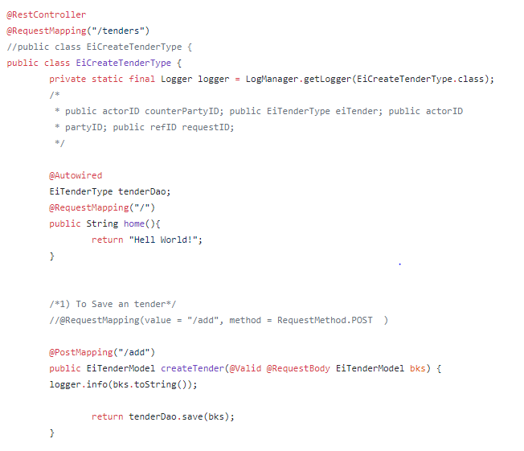
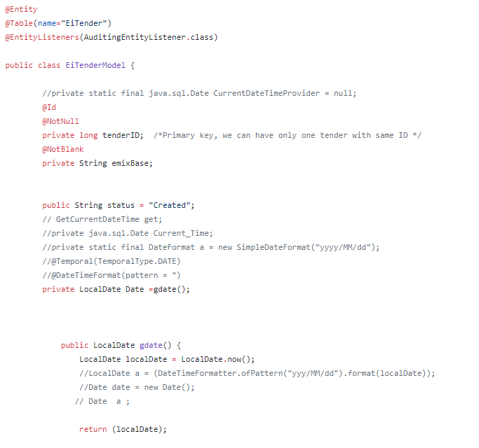

###
# Controller and Model Class for Restful Web Services

### **REST API**

An  **API**  is an application programming interface. It is a set of rules that allow programs to talk to each other. The developer creates the API on the server and allows the client to talk to it.

**REST**  determines how the API looks like. It stands for &quot;Representational State Transfer&quot;. It is a set of rules that developers follow when they create their API. One of these rules states that you should be able to get a piece of data when you link to a specific URL.

Each URL is called a  **request**  while the data sent back to you is called a  **response**.

A request is made up of four things:

- The endpoint
- The method
- The headers
- The data (or body)

**End-point structure**

root-endpoint/?

The root-endpoint is the starting point of the API you&#39;re requesting from. The  **path**  determines the resource you&#39;re requesting for.

**Controller Class**

Controller receives HTTP requests from the Spring front controller and simply delegates them forward to a service layer.

Spring Boot [annotations ](http://www.java67.com/2019/01/top-5-spring-boot-annotations-java-programmers-should-know.html)for handling different HTTP request types

- @RequestMapping — For handling any request type
- @GetMapping — GET request
- @PostMapping — POST request
- @PutMapping — PUT request
- @DeleteMapping — DELETE request

Example:

Path variables are variables in the request URL and annotated with &quot;[@PathVariable](https://javarevisited.blogspot.com/2017/10/differences-between-requestparam-and-pathvariable-annotations-spring-mvc.html#axzz5jtleVQXB)&quot;. The request mappings are straightforward **, the actual ** _value_ ** of the mapping as well as the HTTP method, determine the target method for the request.**  @_RequestBody_ will bind the parameters of the method to the body of the HTTP request, whereas _@ResponseBody_ does the same for the response and return type.

Now, you can get all the tenders by going to the following URL in Postman:

[http://localhost:8080/tenders/allTenders](http://localhost:8080/tenders/allTenders)

You can screen a specific tender by going to the following URL and select GET.

[http://localhost:8080/tenders/search/{id}](http://localhost:8080/tenders/search/%7bid%7d)

You can create a new tender by going to the following URL and select POST.

[http://localhost:8080/tenders/add](http://localhost:8080/tenders/add)

Similarly, you can delete the tender by going to the assigned URL.

**Model Class**

Model Class in our case is for Tender which will have tenderID, emixBase, transactionID, status and date as its properties.

&#39;**@Table(name= &quot;EiTender&quot;)**&#39; is used for creating a table with name **EiTender** in the MySQL database.

&#39;**@Column(name= &quot;tenderID&quot;)**&#39; is used to create a column with a particular name &#39;tenderID&#39; in the **EiTender** table in the database.

[_@JoinColumn_](https://www.baeldung.com/jpa-join-column) annotation helps us specify the column we&#39;ll use for joining an entity association or element collection.

Finally, @NotNull annotation is used to apply Not Null Constraint on a column.

Getter and Setter methods are used to set and get the required information from Entity Model.

Example:

