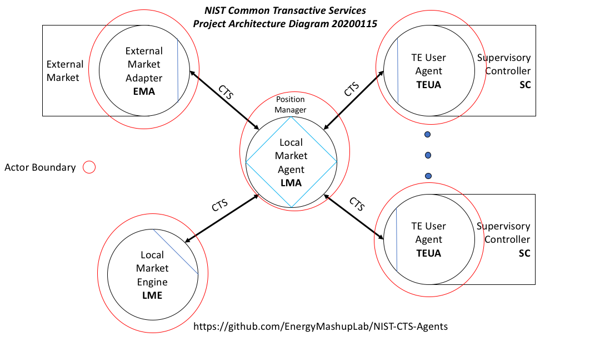

NIST-CTS Utility Classes in Java
========

Background
----------
See the project [README](../../README.md)

Technical Description Java Utilities Component
---------------------

The NIST-CTS Project is a standards-based implementation of the Common
Transactive Services and a Market Agent and a Transactive Energy Agent. See the
respective repositories' README files for a closer view; see  the project See the project [README](../../README.md) for an overview

-   **Utilities**

    -   Common Transactive Services (CTS) implementation, using the TEMIX profile of [OASIS Energy
    Interoperation](https://docs.oasis-open.org/energyinterop/ei/v1.0/os/).

    -   ei2j--Energy Interoperation to and from Java. ei2j allows the Supervisory Controller (see architecture diagram in the project [README](../../README.md). The Java representation will be drawn from an informative UML model developed in parallel with OASIS Energy Interoperaton.

    -   Logging and input for live and simulation meter and other data. 
    --  Since one target environment is a simulation, the input data such as energy amounts used or demanded will be drawn from multi-facility meter data traces. The system also needs to run with live data from instrumented faciliteis.
    --  Input from live feeds and historical wholesale market data may be used as well.
   
    -   Ledgers keep records of tenders and transactions; they can be saved to a file or possibly sent over a network connection as the design matures. See the project [README](../../README.md) for terminology clarifying Positions, Ledgers, and Traces.
    
A summary of where the utility code is used is in the project README: 

Standards Used
--------------

The project uses standards including

-   The TEMIX profile of [OASIS Energy
    Interoperation](https://docs.oasis-open.org/energyinterop/ei/v1.0/os/).
    Energy Interoperation is the profile base of [OpenADR 2] standardized as
    [IEC 62746-10-1] (<https://webstore.iec.ch/publication/26267>)

-   Informative UML models for Energy Interoperation/CTS payloads as shown in
    the EI Standard

-   ISO 17800 Facility Smart Grid Information Model
    (<https://www.iso.org/standard/71547.html> )

-   Adapter methods for integrating with Independent System Operator Wholesale
    Markets and other energy markets are based on [IEC 62746-10-3:2018]
    (<https://webstore.iec.ch/publication/59771>)

Built With
----------

Agile programming and architecture are used.

The project uses Github, Maven, and Java 8.

Authors
-------

-   **William Cox** - *Architecture* - [Cox Software Architects
    LLC](http://coxsoftwarearchitects.com/)

-   **Toby Considine –** *Architecture* – [TC9 Inc](http://www.tc9.com/)

See also the list of [contributors] who participated in this project.

License
-------

This project is licensed under the Apache 2.0 License.

Acknowledgments
---------------
