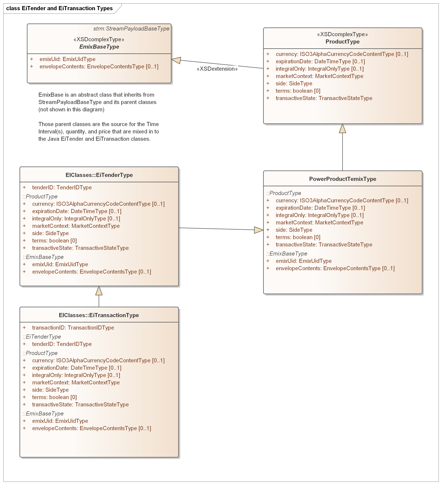

Standards and Models Used
====================
### Standards Used

The project uses standards including

-   The TEMIX profile of [OASIS Energy
    Interoperation](https://docs.oasis-open.org/energyinterop/ei/v1.0/os/).
    Energy Interoperation is the profile base of [OpenADR 2] standardized as
    [IEC 62746-10-1] (<https://webstore.iec.ch/publication/26267>)

-   Informative UML models for Energy Interoperation/CTS payloads as shown in
    the EI Standard
    
-   UML models for scheduling using the [WS-Calendar Platform-Independent Model](http://docs.oasis-open.org/ws-calendar/ws-calendar-pim/v1.0/ws-calendar-pim-v1.0.html)

-   The [WS-Calendar Minimal PIM-Conformant Schema](http://docs.oasis-open.org/ws-calendar/ws-calendar-min/v1.0/ws-calendar-min-v1.0.html)

-   ISO 17800 Facility Smart Grid Information Model
    (<https://www.iso.org/standard/71547.html> )

-   Adapter methods for integrating with Independent System Operator Wholesale
    Markets and other energy markets are based on [IEC 62746-10-3:2018]
    (<https://webstore.iec.ch/publication/59771>)

### UML Model Description 
Most of these standards were built and defined using UML models. In some cases the UML is normative (WS-Calendar PIM, ISO 17800) and others informative (Energy Interoperation, EMIX, and initial versions of WS-Calendar).

For the development of this project we have been informed by the standards' UML models, and simplified them for easier use, while ensuring that a conformance statement would accurately describe the standards aspects of this project.

### Simplifying the UML Model
For the EiTender and EiTransaction classes, we flatten the model inheritance hierarchy as shown in the diagram .

The price and time interval are not shown in the diagram, as they are high in the inheritance hierarchy, so we explicitly include them in the EiTender and EiTransaction Java classes.

Note that the standards describe streams of time intervals; we simplify to one time interval only.
