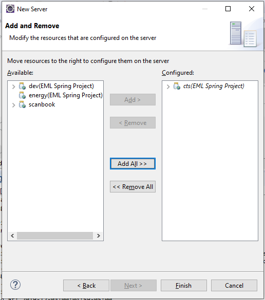

Running NIST CTS Agents
------------------------------
### Importing Maven Projects from Git into Eclipse
#### Step 1: 

Select the folder where you want to create the local storage (on your local machine), right click and select &#39;Git Bash Here&#39;.


#### Step 2: 

Use the command &#39;git clone&#39; to create a clone of the repository.


Change the directory using &#39;cd&#39; command and go to NIST-CTS-Agents.

#### Step 3:

In Eclipse select the File menu and then select Import.


#### Step 4:

Select Existing Maven Projects and click on next. (*Note that Eclipse from the Spring Boot download and direct download work the same)*


#### Step 5:

Browse to the local NIST-CTS-Agents folder (cloned from Github) and click finish. The project is now imported in Eclipse.

#### Step 6:

Right click on project, go to Run As and select Maven Build.

You will get a Build success message in the console. *Note that the Build button will use the most recent detailed build instructions during the current execution of the Eclipse environment*


#### Step 7: Configuring Tomcat Server 

Detailed notes at [this site](https://professionalhacker.in/how-to-install-tomcat-on-mac/)


#### Step 8: 

Select tomcat server from the list of those installed on your local machine and click next.

Spring Tool Suite 4.5 does not have this wizard selector; instead for Step 8 and Step 9 right click on the project and select a server.


#### Step 9: 

Move the project to configure it to the server *Picture shows after selecting the project and clicking Add*



Now the server is configured.

#### Step 10: Creating the Database 

Database initialization was done using MySql Community Edition and Workbench 8.0.18 on Mac OS X 10.15.2. SpringTool Suit 4 and JDBC will initialize the database and schemas with no manual intervention when using the developement enviroment mentioned before. 

If you are not using this enviroment, you may have to create the database and schemas manually.

**Manual Database Initialization:**

1. In MySql Workbench, create a new user "eml" with the password "capstone123".
2. Create a new "Schema" (database show with the disk icon) called *nist_cts_eml*
3. Give user *capstone* permission to access *nist_cts_eml* from localhost
4. Remember to apply all changes and refresh the *nist_cts_eml* schema.
5. Run the project application in SpringToolSuite
6. In MySql Workbench, refresh all for the schema *nist_cts_eml*.

Instructions for the creation using the command line are as follows. Remember that semicolon is the terminator for mysql commands, not a separator.

 *NOTE: user name is set as eml@localhost and the password is set as capstone123.*

```
    mysql --user=root --password 
    create database nist_cts_eml;
    create user capstone@localhost identified by "";
    grant all on nts_cts_eml.* to capstone@localhost;
```

#### Step 11:

Right click on the project, go to Run As, and click on Spring Boot App. You can also use Run As &rightarrow; Run on Server.

 

#### Step 12: 

The project is now running. Open the browser and go to localhost:8080 to view the project
