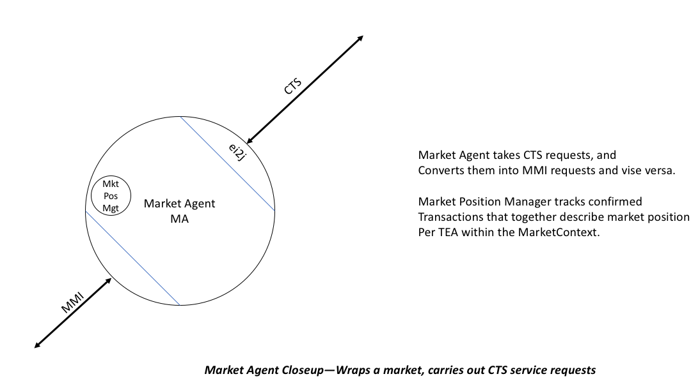

NIST-CTS Market Agent
========

Background
----------
See the project [README](../../README.md)

Technical Description Market Agent
---------------------
The NIST-CTS Project is a standards-based implementation of the Common
Transactive Services and a Market Agent and a Transactive Energy Agent. See the
respective repositories' README files for a closer view; see  the project See the project [README](../../README.md) for an overview

-   **Market Agent** (MA) which interacts with the markets and with Transactive
    Energy Agents using the CTS including
    
    -   The Market Modular Interface
    
    -   Market Position Management
    
    -   Uses ei2j capabilities for CTS connections
    
    -   (Optional and future) links to wholesale markets

See the Architecture Drawing for the Market Agent: 

Standards Used
--------------

The project uses standards including

-   The TEMIX profile of [OASIS Energy
    Interoperation](https://docs.oasis-open.org/energyinterop/ei/v1.0/os/).
    Energy Interoperation is the profile base of [OpenADR 2] standardized as
    [IEC 62746-10-1] (<https://webstore.iec.ch/publication/26267>)

-   Informative UML models for Energy Interoperation/CTS payloads as shown in
    the EI Standard

-   ISO 17800 Facility Smart Grid Information Model
    (<https://www.iso.org/standard/71547.html> )

-   Adapter methods for integrating with Independent System Operator Wholesale
    Markets and other energy markets are based on [IEC 62746-10-3:2018]
    (<https://webstore.iec.ch/publication/59771>)
    
Built With
----------

Agile programming and architecture are used.

The project uses Github, Maven, and Java 8.

Authors
-------

-   **William Cox** - *Architecture* - [Cox Software Architects
    LLC](http://coxsoftwarearchitects.com/)

-   **Toby Considine –** *Architecture* – [TC9 Inc](http://www.tc9.com/)

See also the list of [contributors] who participated in this project.

License
-------

This project is licensed under the Apache 2.0 License.

Acknowledgments
---------------
