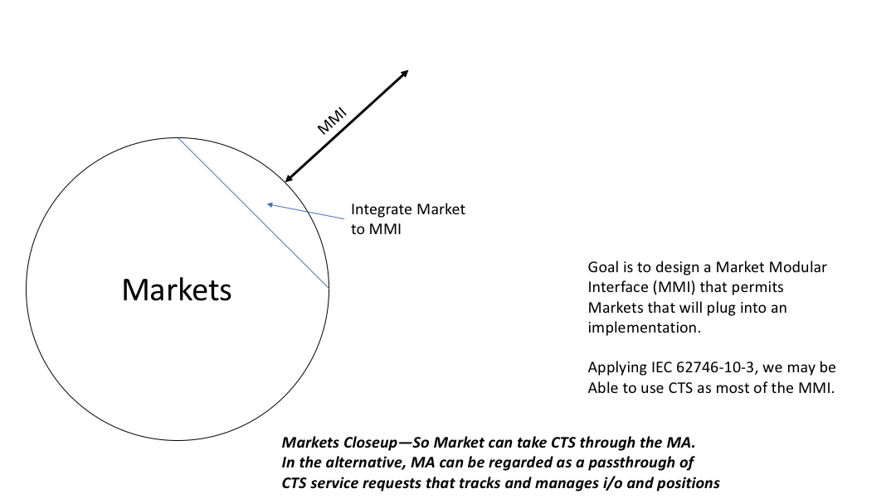

NIST-CTS Markets
========

Background
----------
See the project [README](../../README.md)

Technical Description Markets Component
---------------------

The NIST-CTS Project is a standards-based implementation of the Common
Transactive Services and a Market Agent and a Transactive Energy Agent. See the
respective repositories' README files for a closer view; see  the project See the project [README](../../README.md) for an overview

-   **Markets** including

    -   The Market Modular Interface (**MMI**), a logical service provider interface for market implementations

    -   Market Position Management (**MPM**) is in the current design in the Market Agent, to keep track of positions, i.e., committed purchases and sales

    -   A bilateral market

    -   (Optional and future) links to wholesale markets, which present as open tenders

    -   (future) Additional plug-in markets and integration documentation

This project will develop Transactive Energy User Agents (TEUA) interacting through
Markets. We will define interfaces between an energy system and the Actor (TEUA)
that represents it. TEUAs will interact with a Market Agent/Actor that
encapsulates market behavior. While the project uses a Bilateral Market model,
the Market Agent will incorporate a Market Modular Interface to support other
market models.

With respect to markets, Bilateral Market is classification; Double Auction and Order Book are two subclassifications within bilateral markets.

See the Architecture Drawing for Markets: 

Standards Used
--------------

The project uses standards including

-   The TEMIX profile of [OASIS Energy
    Interoperation](https://docs.oasis-open.org/energyinterop/ei/v1.0/os/).
    Energy Interoperation is the profile base of [OpenADR 2] standardized as
    [IEC 62746-10-1] (<https://webstore.iec.ch/publication/26267>)

-   Informative UML models for Energy Interoperation/CTS payloads as shown in
    the EI Standard

-   ISO 17800 Facility Smart Grid Information Model
    (<https://www.iso.org/standard/71547.html> )

-   Adapter methods for integrating with Independent System Operator Wholesale
    Markets and other energy markets are based on [IEC 62746-10-3:2018]
    (<https://webstore.iec.ch/publication/59771>)

Built With
----------

Agile programming and architecture are used.

The project uses Github, Maven, and Java 8.

Authors
-------

-   **William Cox** - *Architecture* - [Cox Software Architects
    LLC](http://coxsoftwarearchitects.com/)

-   **Toby Considine –** *Architecture* – [TC9 Inc](http://www.tc9.com/)

See also the list of [contributors] who participated in this project.

License
-------

This project is licensed under the Apache 2.0 License.

Acknowledgments
---------------
